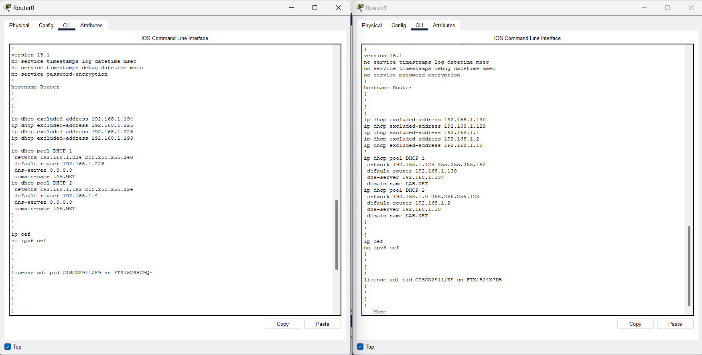
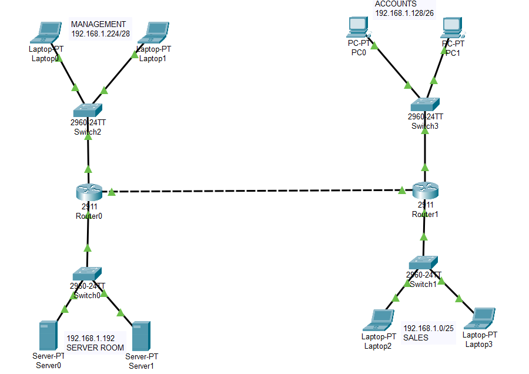
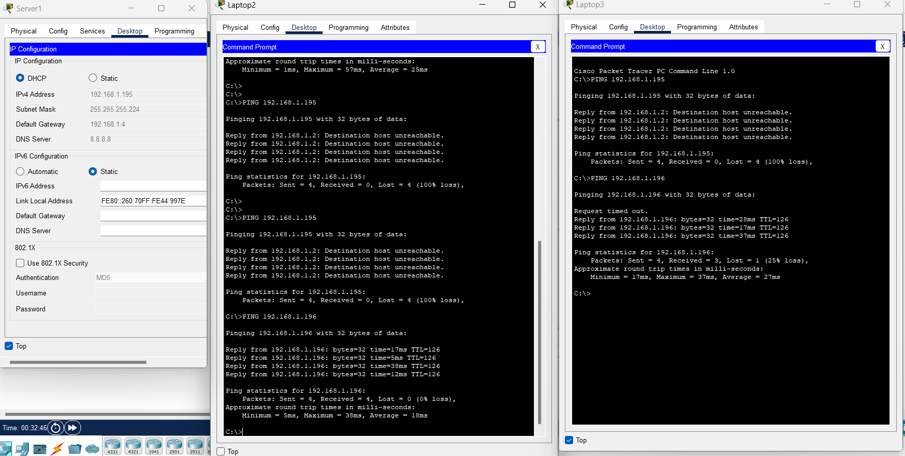
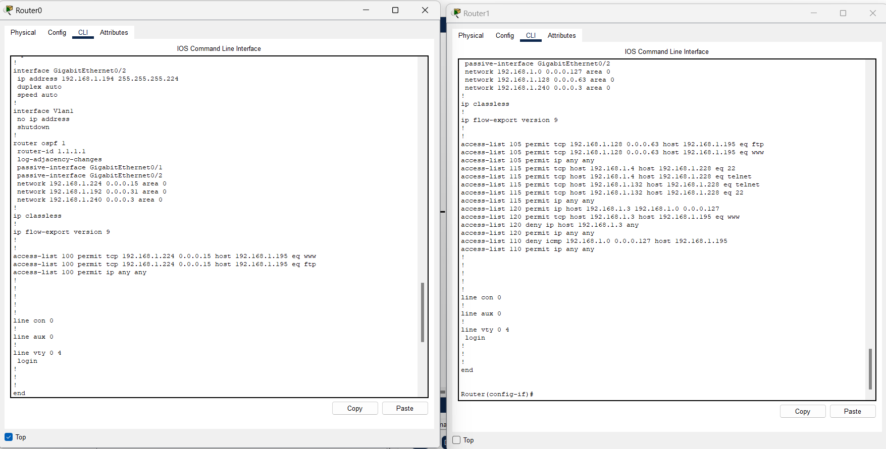
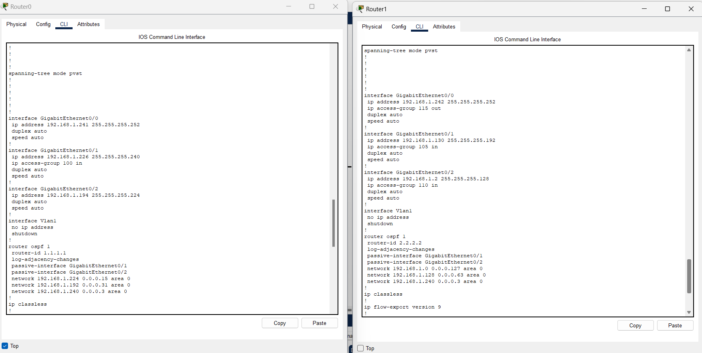

# 🌐 Lab Réseau Multi-Sites – DHCP, OSPF & ACL (Cisco Packet Tracer)

Ce projet est un laboratoire réseau réalisé sous **Cisco Packet Tracer**, simulant l'interconnexion de deux sites d'entreprise via un routage dynamique **OSPF**, avec attribution automatique des adresses IP par **DHCP** et un **contrôle d'accès (ACL)** strict entre les différents services/départements.

## 📌 Description du lab

L'objectif de ce lab est de mettre en place une infrastructure réseau sécurisée pour une entreprise répartie sur deux sites reliés par une liaison WAN :

- **Site 1** : héberge le service **Management**, et la **Salle Serveurs** (Server Room) avec deux serveurs (Server0 et Server1)
- **Site 2** : héberge les services **Accounts** (Comptabilité) et **Sales** (Ventes)

Chaque site dispose de son propre routeur (Router0 / Router1) assurant le routage inter-sites via **OSPF**, et de switches distribuant l'accès aux différents postes. Une fois la connectivité globale assurée (reachability), des **listes de contrôle d'accès (ACL)** ont été appliquées pour restreindre les communications entre départements selon des règles métier précises.

## 🗺️ Topologie

- **Router0** (Site 1) ↔ **Router1** (Site 2) : liaison inter-sites (OSPF, area 0)
- **Switch2** → Management : Laptop0, Laptop1 — réseau `192.168.1.224/28`
- **Switch0** → Server Room : Server0, Server1 — réseau `192.168.1.192/27`
- **Switch3** → Accounts : PC0, PC1 — réseau `192.168.1.128/26`
- **Switch1** → Sales : Laptop2, Laptop3 — réseau `192.168.1.0/25`

## ⚙️ Configuration réalisée

### 1. DHCP
- Pools DHCP configurés sur Router0 et Router1 (un pool par réseau : Management/Server Room sur Router0, Accounts/Sales sur Router1)
- Adresses exclues pour les passerelles, serveurs et postes à IP fixe

### 2. Routage OSPF
- OSPF **area 0** activé sur les deux routeurs (router-id dédié à chacun)
- Interfaces LAN déclarées en **passive-interface** (pas d'annonce OSPF vers les hôtes)
- Seul le lien inter-routeurs participe activement à l'échange OSPF

### 3. Spanning Tree
- Mode **PVST** activé sur les deux routeurs/switches

### 4. Listes de contrôle d'accès (ACL)

| # | Règle métier |
|---|--------------|
| **Tâche 1** | Management et Accounts peuvent accéder uniquement en HTTP (80) et FTP (21) à **Server0**, depuis la Server Room |
| **Tâche 2** | Sales peut accéder à **Server1** avec tous les protocoles, **sauf le PING (ICMP)** |
| **Tâche 3** | Laptop2 (Sales) et PC0 (Accounts) peuvent accéder à Laptop0 (Management) |
| **Tâche 4** | Laptop3 (Sales) ne peut accéder qu'à son propre réseau (Sales) et uniquement au service Web (80) sur Server1 |

Ces règles ont été implémentées via des ACL étendues (numérotées 100, 105, 110, 115 et 120) appliquées sur les interfaces concernées des deux routeurs, puis validées par des tests de ping et de connectivité entre les postes.

## ✅ Résultats / Validation

- Connectivité globale (reachability) confirmée entre tous les sites avant application des ACL
- Tests de ping après application des ACL : les flux autorisés passent normalement, les flux interdits (ex. ICMP vers Server1 depuis Sales) renvoient bien un `Destination host unreachable`
- Comportement conforme aux règles métier demandées

## 🖼️ Captures d'écran

> 💡 Les captures ci-dessous sont uploadées directement à la racine du dépôt (pas de sous-dossier), à côté de ce README.

| # | Fichier | Description |
|---|---------|--------------|
| 1 | `01-configuration-dhcp-router0-router1.png` | Configuration des pools DHCP (adresses exclues, réseaux, passerelles) sur Router0 et Router1 |
| 2 | `02-topologie-reseau-sites.png` | Schéma complet de la topologie : Management, Server Room, Accounts, Sales |
| 3 | `03-tests-acl-ping-laptop2-laptop3.png` | Tests de ping depuis Laptop2 et Laptop3 validant les restrictions ACL vers Server0/Server1 |
| 4 | `04-configuration-ospf-acl-avancee.png` | Configuration OSPF, interfaces et ACL étendues (100, 105, 110, 115, 120) |
| 5 | `05-configuration-interfaces-ospf-spanning-tree.png` | Configuration des interfaces, OSPF area 0 et spanning-tree PVST sur les deux routeurs |

## 🧰 Outils utilisés

- Cisco Packet Tracer
- IOS CLI (routeurs Cisco 2911)

## 👤 Auteur

## ALAYE Odilon Alabi 

Lab réalisé dans le cadre d'un exercice pratique d'administration réseau (DHCP, OSPF, ACL, segmentation multi-sites).
